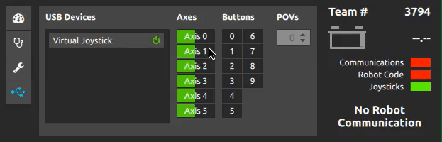

The QDriverStation is a cross-platform and open-source alternative to the FRC Driver Station. It allows you to operate FRC robots with the major operating systems (Windows, Mac OSX and GNU/Linux). The QDriverStation is able to operate both 2009-2014 robots and 2015-2016 robots.

The actual code that operates a FRC robot is found in a [separate repository](https://github.com/WinT-3794/LibDS), which you can use in your own Qt projects or change it to support older (and future) communication protocols.

Our application is free to use, share and modify. You are welcome to test it and see the code to understand how it works!

### Install notes

You can download the QDriverStation from both [SourceForge](http://sf.net/p/qdriverstation) and [GitHub](http://github.com/wint-3794/qdrivertation). We recommend you to download QDriverStation from GitHub, since SourceForge is known for serving misleading advertisements.

Once you finish installing the software, you can launch it and begin driving your robot. Just be sure to input your team number and to verify that the joysticks are working correctly.

Mac users will be prompted to download an additional driver for Xbox 360 controllers to work.

###### Note for Linux users

If you happen to use ArchLinux, [lopsided98](https://github.com/lopsided98) configured a [repository](https://aur.archlinux.org/packages/qdriverstation-git/) for this project.

Until very recently, I did not generate Debian packages. [Dakota Keeler](https://github.com/bearzrobotics) provided a [package for version 0.14](https://drive.google.com/file/d/0BwmIj7Fz03lXZ1JjYnhLVVdRR0E/view) and made a [video tutorial](https://www.youtube.com/watch?v=G9DywTB9_cY) on how to compile the QDriverstation, which you may find very helpful.

###### Warnings

If you are on Linux, the QDriverStation may detect some devices as a joystick ([more info...](https://gist.github.com/denilsonsa/978f1d842cf5430f57f6#file-51-these-are-not-joysticks-rules)). If that happens, just disable the faulty device by clicking on the power button next to its name:

### Build instructions

###### Requirements

The only requirement to compile the application is to have [Qt](http://www.qt.io/download-open-source/) installed in your system. The desktop application will compile with Qt 5.2 or greater.

- If you are using Linux, make sure that you have installed the following packages:
    - libsdl2-dev

The project already contains the compiled SDL libraries for Windows and Mac.

###### Compiling the application

Once you have Qt installed, open *QDriverStation.pro* in Qt Creator and click the "Run" button.

Alternatively, you can also use the following commands:
- qmake
- make
- **Optional:** sudo make install

You can check this [tutorial by Dakota Keeler](https://www.youtube.com/watch?v=G9DywTB9_cY) to compile the QDriverStation.

### Credits

This application was created by [this guy](http://github.com/alex-spataru).

Of course, many people contributed in different ways to this project, you can find more details in the [contributors list](CONTRIBUTORS.md). Finally, we want to thank you for trying this little project, we sincerely hope that you enjoy our application and we would love some of your feedback.
