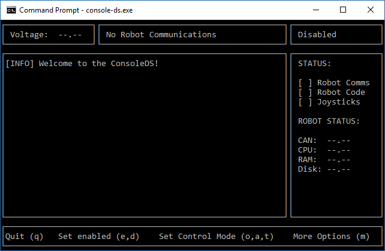

# LibDS-Legacy

[](https://travis-ci.org/FRC-Utilities/LibDS)
[](https://blockchain.info/address/1K85yLxjuqUmhkjP839R7C23XFhSxrefMx "Donate once-off to this project using BitCoin")

The DriverStation library allows you to connect and manage a robot easily by providing an abstraction layer between an application and the network comununications between the robot and the host computer.

The library is written in C, allowing it to be used in many platforms and/or programming languages (using wrappers).

### Features

LibDS implements the following features:

- Modular design
- Dynamic protocol loading
- Integrated event system
- Joystick handling functions
- Safety features
- Abstract-protocol object
- Cross-platform socket handling 

You can check the [TODOs](TODO.md) for the current state of the project.

You may find a lot of mistakes here, be it design choices or just stupid mistakes. If you spot something, I would be very grateful if you could tell me about it (or make a pull request).

### Example Projects



I have created two example projects to demonstrate the uses of LibDS:

- A command-line DS with SDL and ncurses/pdcurses
- A graphical UI DS with Qt4/Qt5 and C++

You can browse the code of the examples [here](examples/)!

### Quick Introduction

#### Initialization

The LibDS has its own event loop, which runs on a separate thread. To start the DS engine, you must call `DS_Init()`, which initializes all the modules of the LibDS (config, events, joysticks, etc).

You should initialize the DS before initalizing any of your application components that interact with the DS. Check this example:

```c
#include <LibDS.h>

int main() {
   /* Initialize the DS */
   DS_Init();

   /* Now proceed to initializing your application */
   DeepMagic();
   VoodooInit();
   HeavyWizardry();
   
   /* Load the 2016 protocol, the protocol can be safely changed during runtime. 
    *
    * Also, the LibDS can operate safely without a loaded protocol, 
    * so there is no rush to call this function. 
    */
   DS_ConfigureProtocol (DS_GetProtocolFRC_2016());
}
```

#### Communication protocols

After initializing the DS, you must load a protocol, which instructs the LibDS on the following processes:

- How to create client packets:
   - DS-to-robot packets
   - DS-to-radio packets
   - DS-to-FMS packets

- How to read and interpret incoming packets

- How to connect to the different network targets:
   - Input and output ports
   - IP protocol type (UDP or TCP)
   - Which IP addresses to use

- Last but not least, the sender timings, for example:
   - Send DS-to-robot packets every 20 ms
   - Send DS-to-FMS packets every 500 ms
   - Do not send DS-to-radio packets

The LibDS has built-in support for the following protocols:
- FRC 2009-2014
- FRC 2015
- FRC 2016 (same as 2015, but with different robot address)

To load a protocol, use the `DS_ConfigureProtocol()` function. As a final note, you can also implement your own protocols and instruct the LibDS to use it. 


#### Interacting with the DS events

The LibDS registers the different events in a FIFO (First In, First Out) queue, to access the events, use the `DS_PollEvent()` function in a while loop. Each event has a "type" code, which allows you to know what kind of event are you dealing with. 

The easiest way to react to the DS events is the following (pseudo-code):

```c
DS_Event event;
while (DS_PollEvent (event)) {
   switch (event.type) {
      case DS_EVENT_X:
         // react to x event
      case DS_EVENT_Y:
         // react to y event
   }
}
```

The code above must be called periodically. Here is a (functional) example:

```c
#include <LibDS.h>
#include <stdio.h>

static void process_events();

int main() {
   DS_Init();
   DS_ConfigureProtocol (DS_GetProtocolFRC_2016());
   
   while (1) {
      process_events();
      DS_Sleep (10);
   }
   
   return EXIT_SUCCESS;
}

void process_events() {
   DS_Event event;
   while (DS_PollEvent (&event)) {
      switch (event.type) {
      case DS_ROBOT_ENABLED:
         printf ("Robot enabled\n");
         break;
      case DS_ROBOT_DISABLED:
         printf ("Robot disabled\n");
         break;
      case DS_ROBOT_CONNECTED:
         printf ("Connected to robot\n");
         break;
      case DS_ROBOT_DISCONNECTED:
         printf ("Disconnected to robot\n");
         break;
      case DS_ROBOT_VOLTAGE_CHANGED:
         printf ("Robot voltage set to: %f\n", event.robot.voltage);
         break;
      default:
         break;
      }
   }
}
```

### Project Architecture

#### 'Private' vs. 'Public' members

- All the functions that a client application would be interested in are located in [`DS_Client.h`](https://github.com/FRC-Utilities/LibDS-C/blob/master/include/DS_Client.h). 

- Functions that are used by the protocols to update the state of the LibDS are made available in [`DS_Config.h`](https://github.com/FRC-Utilities/LibDS-C/blob/master/include/DS_Config.h). Calling any of the 'setter' functions in [`DS_Config`](https://github.com/FRC-Utilities/LibDS-C/blob/master/include/DS_Config.h) will trigger an event (which can later be used by the client application).

#### Protocols

Protocols are encapsulated structures. When a protocol is initialized, it defines its properties and its respective data functions. The different functions of the LibDS will then operate with the data and properties defined by the current protocol.

As with the original LibDS, protocols have access to the `DS_Config` to update the state of the LibDS.

The base protocol is implemented in the [`DS_Protocol`](https://github.com/FRC-Utilities/LibDS-C/blob/master/include/DS_Protocol.h#L33) structure.

##### Sockets

Instead of manually initializing a socket for each target, data direction and protocol type (UDP and TCP). The LibDS will use the [`DS_Socket`](https://github.com/FRC-Utilities/LibDS-C/blob/master/include/DS_Socket.h#L56) object to define ports, protocol type and remote targets. 

All the logic code is in [`socket.c`](https://github.com/FRC-Utilities/LibDS-C/blob/master/src/socket.c), which will be in charge of managing the system sockets with the information given by a [`DS_Socket`](https://github.com/FRC-Utilities/LibDS-C/blob/master/include/DS_Socket.h#L56) object.

### Compilation instructions

To compile the project, navigate to the project root and run the following commands

* qmake
* make

To install compiled library files, and headers to the correct locations in /usr/local, use this command
* sudo make install
